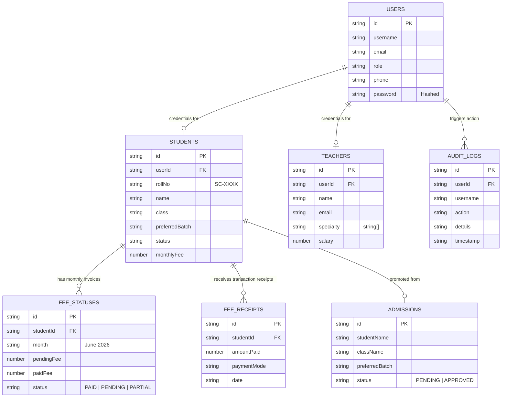
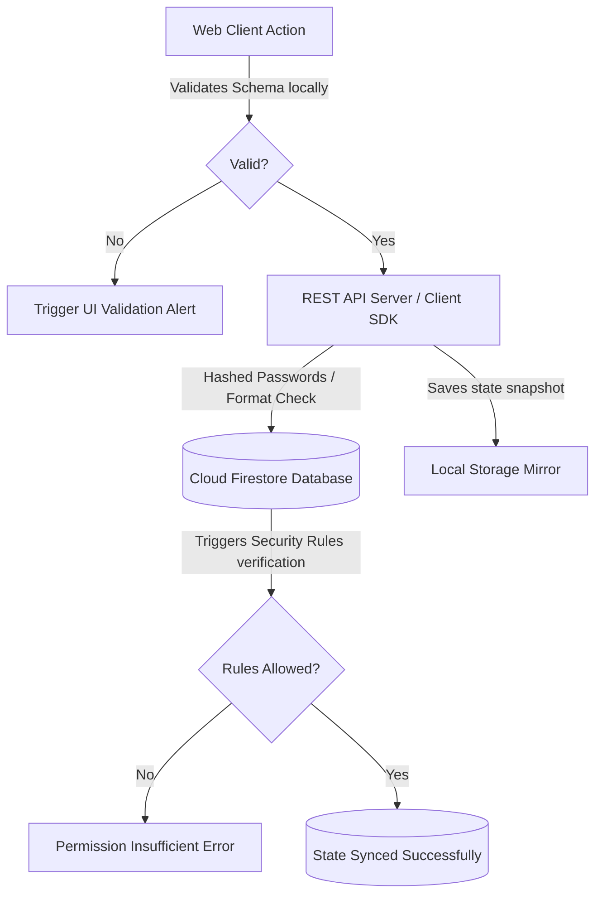

# DATABASE.md — Sunshine ERP Database Specification

This document serves as the absolute single source of truth for the database layer of the **Sunshine Classes ERP (Sunshine ERP)** platform. It details the schema, architecture, permission layers, data integrity mechanisms, performance constraints, and migration strategies.

---

## 1. Overview

### Database Technology
Sunshine ERP leverages **Google Cloud Firestore**, a flexible, scalable, serverless NoSQL document database. 

### Why Firestore Was Chosen
1. **Real-time Synchronization**: Instant data pushes synchronize administrative panels and student portals without polling overhead.
2. **Flexible Document Schemas**: Easily adapts to changing student attributes (e.g., adding dynamic file links or WhatsApp logging flags).
3. **Offline Persistence**: Built-in client-side caching ensures the ERP functions seamlessly even during on-site school network flickers.
4. **Unified Pricing & Maintenance**: Seamless scaling with zero servers or indexes to manually manage for standard lookups.

### Relationships
NoSQL database designs denormalize where appropriate, but Sunshine ERP maintains highly structural cross-document integrity using unique reference identifiers (`studentId`, `userId`, `receiptId`) to bind entities.

---

## 2. Database Architecture

### Entity-Relationship Diagram (NoSQL Schema Models)



### Data Mutation Flow Diagram



---

## 3. Collections Specification

The database coordinates state updates inside the single collection namespace **`sunshine_erp_state`** as high-level document states or standalone mirrors.

---

### A. `users` Document State

#### Purpose
Stores authorization details, login credentials, and role privileges for teachers, students, receptionists, and administrators.

#### Fields

| Field | Type | Required | Description |
| :--- | :--- | :--- | :--- |
| `id` | `string` | Yes | Unique user identifier (matches Firebase Auth UID) |
| `username` | `string` | Yes | Simplified lowercase name used for logging in (e.g. `ankit`, `ankit1`) |
| `name` | `string` | Yes | The user's full readable display name |
| `email` | `string` | Yes | Registered contact address |
| `role` | `string` | Yes | System permissions tier: `FOUNDER`, `CO-FOUNDER`, `ADMIN`, `RECEPTION`, `TEACHER`, `STUDENT` |
| `phone` | `string` | Yes | Associated mobile contact |
| `password` | `string` | Yes | Salted cryptographic password string prefixed as `sha256_` |

#### Relationships
- Links to **`students`** when `role == 'STUDENT'` via `student.userId == users.id`
- Links to **`teachers`** when `role == 'TEACHER'` via `teacher.userId == users.id`

#### Read/Write Permissions
- **Read**: Authenticated users can fetch profiles.
- **Write/Update**: Administrators or Founders only.
- **Delete**: Restricted exclusively to Founders.

#### Example JSON Document
```json
{
  "id": "u-student-9876",
  "username": "ankitsen",
  "name": "Ankit Sen",
  "email": "ankit@example.com",
  "role": "STUDENT",
  "phone": "9876543210",
  "password": "sha256_8c6976e5b5410415bde908bd4dee15dfb167a9c873fc4bb8a81f6f2ab448a918"
}
```

---

### B. `students` Document State

#### Purpose
Represents active enrolled pupils, tracking their class assignments, details, contact logs, and profile attachments.

#### Fields

| Field | Type | Required | Description |
| :--- | :--- | :--- | :--- |
| `id` | `string` | Yes | Primary Student Key (prefixed `s-`) |
| `userId` | `string` | Yes | Foreign Key referencing associated login account |
| `rollNo` | `string` | Yes | Distinct sequential school ID formatted as `SC-XXXX` |
| `name` | `string` | Yes | Student's full name |
| `class` | `string` | Yes | Current grade level assignment (e.g. `Class 10`) |
| `preferredBatch` | `string` | Yes | Assigned batch roster group name (e.g. `Class 10 - Evening Stars`) |
| `fatherName` | `string` | Yes | Father's full name |
| `motherName` | `string` | Yes | Mother's full name |
| `dob` | `string` | Yes | Birthdate formatted as `YYYY-MM-DD` |
| `gender` | `string` | Yes | Gender identifier (`Male` \| `Female` \| `Other`) |
| `address` | `string` | Yes | Residential mailing address |
| `mobile` | `string` | Yes | Registered primary contact phone |
| `whatsapp` | `string` | Yes | WhatsApp notifications mobile |
| `email` | `string` | Yes | Secondary communication email |
| `admissionDate` | `string` | Yes | Intake date string |
| `status` | `string` | Yes | Active status: `ACTIVE`, `SUSPENDED`, `COMPLETED`, `DEPARTED` |
| `monthlyFee` | `number` | Yes | Customized class tuition rate |
| `photoUrl` | `string` | No | Direct Cloudinary secure link for portrait |

#### Relationships
- Links to **`users`** via `userId`
- Links to **`fee_statuses`** via `studentId`

#### Example JSON Document
```json
{
  "id": "s-new-10395",
  "userId": "u-student-9876",
  "rollNo": "SC-1002",
  "name": "Ankit Sen",
  "class": "Class 10",
  "preferredBatch": "Class 10 - Evening Stars",
  "fatherName": "Rajesh Sen",
  "motherName": "Sunita Sen",
  "dob": "2010-04-12",
  "gender": "Male",
  "address": "45 Patel Nagar, Pihani",
  "mobile": "9876543210",
  "whatsapp": "9876543210",
  "email": "ankit@example.com",
  "admissionDate": "2026-07-16",
  "status": "ACTIVE",
  "monthlyFee": 1200,
  "photoUrl": "https://res.cloudinary.com/demo/image/upload/v1571/students/student_portrait.jpg"
}
```

---

### C. `teachers` Document State

#### Purpose
Stores school personnel records, salary metrics, active teaching licenses, and specialties.

#### Fields

| Field | Type | Required | Description |
| :--- | :--- | :--- | :--- |
| `id` | `string` | Yes | Primary Teacher Identifier |
| `userId` | `string` | Yes | Reference key mapping associated log-in user profile |
| `name` | `string` | Yes | Full name |
| `email` | `string` | Yes | Professional communication email |
| `phone` | `string` | Yes | Mobile number |
| `specialty` | `array` | Yes | Dynamic list of subjects (e.g., `["Mathematics", "Physics"]`) |
| `qualification` | `string` | Yes | Highest educational certificate acquired |
| `salary` | `number` | Yes | Base monthly pay |
| `status` | `string` | Yes | Active state: `ACTIVE`, `INACTIVE` |

#### Relationships
- Links to **`users`** via `userId`

#### Example JSON Document
```json
{
  "id": "t-admin-1729",
  "userId": "u-teacher-552",
  "name": "Nidhi Mishra",
  "email": "nidhi@example.com",
  "phone": "9988776655",
  "specialty": ["English Literature", "Grammar"],
  "qualification": "MA in English Literature",
  "salary": 18000,
  "status": "ACTIVE"
}
```

---

### D. `fee_statuses` Document State

#### Purpose
Tracks structured monthly financial obligations, discounts, and payment records of active students.

#### Fields

| Field | Type | Required | Description |
| :--- | :--- | :--- | :--- |
| `id` | `string` | Yes | Invoice key matching billing month |
| `studentId` | `string` | Yes | Targeted student references |
| `studentName` | `string` | Yes | Denormalized name for list parsing |
| `month` | `string` | Yes | Calendar billing period (e.g. `July 2026`) |
| `totalFee` | `number` | Yes | Total base fee after discounts |
| `paidFee` | `number` | Yes | Amount cleared by student |
| `pendingFee` | `number` | Yes | Outstanding balance |
| `status` | `string` | Yes | Invoice state: `PAID`, `PENDING`, `PARTIAL` |
| `dueDate` | `string` | Yes | Deadline formatted as `YYYY-MM-DD` |

#### Example JSON Document
```json
{
  "id": "fee-s-new-10395-July-2026",
  "studentId": "s-new-10395",
  "studentName": "Ankit Sen",
  "class": "Class 10",
  "month": "July 2026",
  "totalFee": 1200,
  "discount": 0,
  "scholarship": 0,
  "paidFee": 500,
  "pendingFee": 700,
  "status": "PARTIAL",
  "dueDate": "2026-07-10",
  "paymentHistory": [
    {
      "amount": 500,
      "date": "2026-07-08",
      "mode": "UPI",
      "receiptId": "REC-98721"
    }
  ]
}
```

---

## 4. Query Patterns

Sunshine ERP targets standard, optimized query combinations.

### Get Pending Fees by Student
```javascript
const q = query(
  collection(db, "fee_statuses"),
  where("studentId", "==", targetStudentId),
  where("status", "in", ["PENDING", "PARTIAL"])
);
```

### Search Students in Roster
```javascript
const q = query(
  collection(db, "students"),
  where("class", "==", targetClass),
  where("status", "==", "ACTIVE")
);
```

---

## 5. Security Rules (`firestore.rules`)

```javascript
rules_version = '2';
service cloud.firestore {
  match /databases/{database}/documents {
    // Sunshine Classes State Namespace
    match /sunshine_erp_state/{document} {
      allow read: if true; // Allows offline-first cache seeds
      allow write: if request.auth != null; // Restricts write operations to logged-in accounts
    }
    
    // Core User Registry
    match /users/{userId} {
      allow read: if request.auth != null;
      allow write: if request.auth != null && request.auth.token.admin == true;
    }
  }
}
```

---

## 6. Validation & Integrity

### Business Validation Protocols
- **Fee Integrity**: Out-of-bounds inputs (e.g. `paidFee` exceeding `totalFee` or negative rates) are intercepted before writing.
- **Roll Number Sequence**: Student entries sequentially increment `rollNo` string indexes to guarantee distinct identification formats.
- **Unique Usernames**: Simplified usernames verify existence on both client and server:
  ```typescript
  let generatedUsername = baseUsername;
  let counter = 1;
  while (users.some((u) => u.username === generatedUsername)) {
    generatedUsername = `${baseUsername}${counter}`;
    counter++;
  }
  ```

---

## 7. Migration Strategy

When updating fields in the database:
- **Zero-Downtime Fallbacks**: Define defaults directly during destructuring assignment (e.g., `const { preferredBatch = "Class 10" } = student`).
- **Backward Compatibility**: Keep existing schemas intact; add properties progressively.
- **Field Conversions**: Never run schema-destabilizing raw deletes; instead, write automated backfills to deprecate fields gracefully over time.
