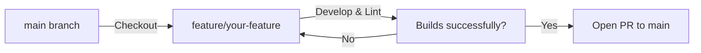

# DEVELOPMENT.md — Sunshine ERP Developer Guide

This document provides a comprehensive, production-grade developer guide for setting up, developing, testing, and deploying the **Sunshine Classes ERP (Sunshine ERP)** platform. It serves as an absolute manual for both human developers and AI assistants to maintain alignment and execution speed.

---

## 1. Overview

### Development Workflow
Sunshine ERP operates on a robust, hot-reloadable full-stack framework utilizing **Vite + React** on the frontend, and a **Node.js + Express** server on the backend. 
- **In Development**: The Express server hosts Vite as a live middleware using `createViteServer({ middlewareMode: true })`. This enables single-port hosting (`PORT 3000`) for both backend REST APIs and frontend assets.
- **In Production**: Vite compiles static frontend bundles directly into `/dist`, and `esbuild` bundles the Express backend server into a single file at `dist/server.cjs`.

### Frontend-Backend Communication
All frontend client mutations communicate with the Node.js server via secure HTTP endpoints routed under `/api/*` (e.g., `/api/enroll`, `/api/chat`). Additionally, the client interacts directly with the **Firebase Web SDK** for direct real-time state reads and lightweight syncs.

---

## 2. Prerequisites

| Tool | Recommended Version | Purpose |
| :--- | :--- | :--- |
| **Node.js** | v20+ (LTS) | Execution Runtime |
| **npm** | v10+ | Dependency and scripts manager |
| **Git** | v2.40+ | Version control |
| **Firebase Console**| Firestore & Auth activated | Database and identity backend |
| **Cloudinary Account**| Active Upload Preset | Image uploads & live camera snapshots |

---

## 3. Project Structure

```text
/
├── server.ts                   # Core Express entry point (bundles APIs and Vite dev middleware)
├── firestore.rules             # Access control rules for Cloud Firestore
├── PROJECT.md                  # Project overview, architecture, and core data structures
├── FEATURES.md                 # Product specifications and feature lifecycle documentation
├── DATABASE.md                 # Database schemas, query configurations, and indexes
├── DEVELOPMENT.md              # Setup, standards, and deployment manual (This file)
├── src/                        # Client-Side Application Code
│   ├── main.tsx                # Client initialization entry point
│   ├── App.tsx                 # Master state orchestrator and central router
│   ├── types.ts                # Strict TypeScript Typings (Single Source of Truth)
│   ├── auth/                   # React session context managers
│   ├── components/             # Reusable UI dashboards and visual elements
│   ├── lib/                    # SDK initializations, utilities, and client-side helpers
│   └── services/               # Integrations (Cloudinary, Twilio, SMTP)
```

---

## 4. Local Setup & Installation

### 1. Clone the Repository
```bash
git clone https://github.com/your-org/sunshine-erp.git
cd sunshine-erp
```

### 2. Install Dependencies
```bash
npm install
```

### 3. Environment Configuration
Copy `.env.example` to create your local `.env` configuration:
```bash
cp .env.example .env
```
*Note: Populate `.env` fields with your local Firebase configurations, Cloudinary presets, and Twilio secret keys. Do not commit actual credentials to Git.*

### 4. Running the Development Server
```bash
npm run dev
```
The server will initialize on `http://localhost:3000`, serving both the API backend and the live-reloading React application synchronously.

### 5. Production Compilation and Verification
Before pushing changes, compile production assets to verify type compatibility:
```bash
npm run build
```
This script will:
1. Run the TypeScript compiler over front-end resources (`tsc --noEmit`).
2. Bundles React resources into `dist/`.
3. Bundles backend services into `dist/server.cjs` using `esbuild`.

---

## 5. Coding & Formatting Standards

To guarantee type-safety and visual consistency, all developers and AI assistants must adhere to these rigid rules:

### A. Non-Negotiable Typings (Strict Schema Boundaries)
1. **Students**: Always use `student.preferredBatch` (type string) for the student's batch name. **DO NOT** use `student.batchId`. Roll numbers are tracked using `rollNo` or `id`.
2. **Teachers**: Always use `teacher.specialty` (type `string[]`) to list assigned subject modules. **DO NOT** use `teacher.subject` as a direct string.
3. **Fee Ledger Status**: Always structures records containing `month` (e.g. `'June 2026'`, `'July 2026'`), `totalFee`, `paidFee`, `pendingFee`, `status` (`'PAID'` | `'PENDING'` | `'PARTIAL'`), and `dueDate` (string formatted `'YYYY-MM-DD'`).

### B. UI & Interactive Element Integrity
- **Deterministic ID Tags**: Every newly created button, form input, checklist selector, or dynamic modal container **MUST** include an explicit, unique, and lowercase `id` attribute (e.g., `id="btn-confirm-attendance"`, `id="inp-student-dob"`).
- **Desktop-First Responsive Framing**: Keep primary visual dashboard spaces styled using responsive max-widths with elegant padding (`w-full max-w-7xl mx-auto px-4 sm:px-6`).
- **Aesthetic Pairings**: Do not include unrequested terminal dashboards, simulated "active/online" telemetry monitors, or low-quality visual clutter. Use Inter for UI elements, Space Grotesk for display headings, and JetBrains Mono exclusively for quantitative data structures.

---

## 6. Development Workflow & Git Best Practices



### Before Submitting a PR
Always run the following local diagnostics before opening a Pull Request:
- **Linter Audit**:
  ```bash
  npm run lint
  ```
  Ensure all unused variables, type mismatch errors, and React dependency warnings are resolved.

---

## 7. Troubleshooting & Common Failures

### 1. "Target Content Not Found" on surgical edits
- **Cause**: Occurs when code blocks within the editing manifest get out of sync with concurrent development branches.
- **Fix**: Immediately run `view_file` on the target code file to inspect current line metrics before retrying operations.

### 2. "Firebase Auth / Missing Permissions"
- **Cause**: Security rules in `firestore.rules` intercept write operations from unauthenticated clients.
- **Fix**: Verify your test account login details, and ensure write transactions are accompanied by real Auth tokens.

---

## 8. AI Collaboration Rules (Mandatory for AI Assistants)

1. **Review Context First**: Before performing any modifications, you **MUST** read `PROJECT.md`, `FEATURES.md`, and `DATABASE.md` to ensure total alignment.
2. **Preserve Current State**: Never delete active features, deprecated endpoints, or bypass typing constraints unless explicitly asked.
3. **Keep Docs Synchronized**: Whenever adding new endpoints, collections, or properties, update the respective section in `PROJECT.md` or `DATABASE.md` in the same turn.
4. **Compile Before Ending Turn**: Always execute `lint_applet` and `compile_applet` to confirm zero compilation friction.
