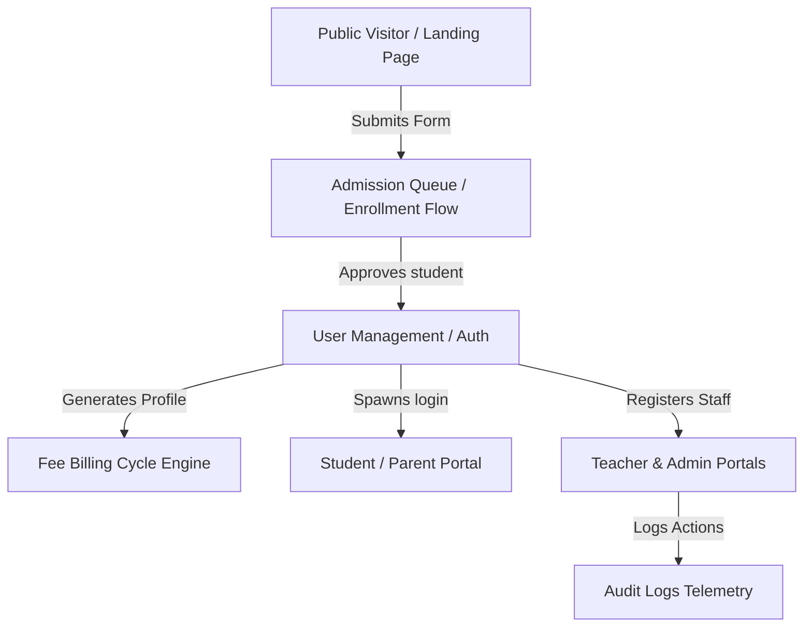
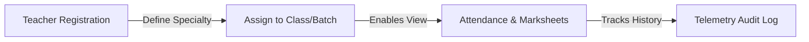
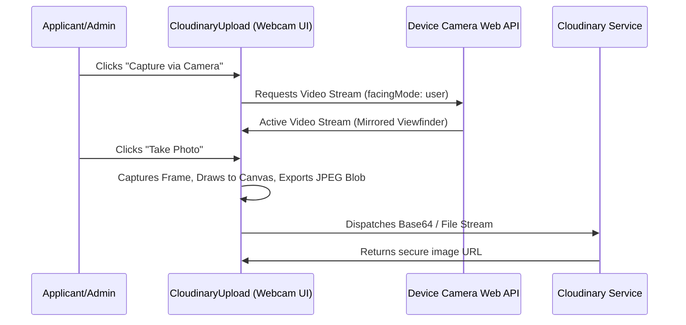

# FEATURES.md — Sunshine ERP Master Feature Specification

This document provides a highly detailed, professional, and continuously maintainable specification of every feature integrated within the **Sunshine Classes ERP (Sunshine ERP)** platform. It acts as the master technical and functional reference for developers, administrators, and AI assistants.

---

## Project Information
- **Project Name**: Sunshine Classes ERP (Sunshine ERP)
- **Version**: 2.1.0 (Dynamic Full-Stack & Device Camera Integration Update)
- **Last Updated**: July 2026
- **Current Status**: Active, Fully Operational, and Production-Ready

---

# Feature Categories



---

## 1. Authentication & Session Management

### Google Login & Session Management
- **Purpose**: Provides quick, secure, passwordless authentication using Google's OAuth 2.0 system.
- **Workflow**:
  1. The user clicks the "Sign in with Google" button on the login modal.
  2. The Google OAuth pop-up initializes and validates credentials.
  3. Upon callback, if the email matches an existing account in our Firestore `users` database, they are successfully signed in and redirected to their respective role dashboard.
- **Permissions**: Available to all registered roles whose email matches a database record.
- **Database Collections**: `users` (Firestore)
- **Session Handling**: Enforces real-time state tracking using React Context (`useAuth.tsx`) backed by Firebase Authentication's persistent tokens. Session status persists on page reload.

### Simplified Username & Password Auth
- **Purpose**: Allows students, teachers, and staff to log in using compact, human-friendly credentials without requiring a pre-existing Google account.
- **Simplified Policy**:
  - **Username**: Auto-generated during creation using the first name (lowercased) and an optional numeric counter to prevent duplicates (e.g. `rohit`, `rohit1`).
  - **Password**: Set by default to `"Sunshine123"` during account registration.
  - **Hashed Storage**: Cryptographically hashes credentials using `simpleSecureHash` on both client and server before committing to database fields to guarantee maximum protection.
  - **Instant Popup**: When an administrator or receptionist approves an online admission or registers a new student/teacher, an alert popup instantly displays the generated username and password on-screen for direct distribution.
- **Workflow**: Employs an intelligent fallback system. On login submission, if the account exists only as a local/Firestore seed user but does not yet exist in Firebase Authentication, the app verifies the hashed password and automatically provisions their real login credentials in Firebase Auth dynamically.

### Password Reset & Password Change Modules
- **Purpose**: Enables users to recover or modify their login credentials.
- **Workflow**:
  1. **Reset**: An automated password reset email is dispatched via Firebase Auth to the registered address.
  2. **Change**: Logged-in users can update their passcode in their dashboard's setting tray, which validates complexity rules (strict compliance constraints if configured) and writes the new credentials securely.

---

## 2. User Management & Role-Based Access Control (RBAC)

The platform supports **six distinct user roles**, each with rigorous boundaries, views, and execution permissions.

| User Role | Purpose | Permissions | Dashboard Access |
| :--- | :--- | :--- | :--- |
| **Founder** | Primary executive director | Full global access: finances, audit logs, staff salary audits, configurations. | Global Admin Panel & Config |
| **Co-Founder** | Joint chief executive | Identical to Founder, full data reading and financial telemetry. | Global Admin Panel & Config |
| **Admin** | System manager | Complete CRUD for students, fees, classes, timetables, and teacher assignments. | Full Admin Panel Workspace |
| **Receptionist** | Front-desk registrar | Admission processing, manual fee collections, subscription toggles, student search. | Reception Dashboard Panel |
| **Teacher** | Class instructor | Marks attendance, creates homework, grades exams, views timetables, writes notes. | Teacher Workspace |
| **Student** | Active learner | Views calendars, registers homework submissions, tracks fees, chats with AI bot. | Student Portal Dashboard |

---

## 3. Student Management

### Admissions Intake
- **Purpose**: Enrolls prospects into the active database.
- **Workflow**: Collects detailed demographics (student name, parents, DOB, mobile, WhatsApp, email, address, preferred batch, class, previous school, and Aadhar).
- **Online Approvals**: One-click approvals immediately create Student files, generate credentials, prompt a popup, and append fee status ledgers.

### Student Profile & Search Filters
- **Purpose**: Allows quick access and updates to student details.
- **Business Logic**: Administrators or receptionists can search by Name, Roll Number, or Class, and filter active lists dynamically by status (`ACTIVE`, `SUSPENDED`, `COMPLETED`, `DEPARTED`).

---

## 4. Teacher Management



### Teacher Registration & Specializations
- **Purpose**: Registers educational staff.
- **Constraint**: Teachers' subjects are managed under the `specialty` property as a dynamic `string[]` list (e.g. `["English", "Science"]`). Direct single strings under `subject` are strictly forbidden.
- **Interactive Workspace**: Displays assigned class rosters, active student lists, student performance indexes, and timetables.

---

## 5. Reception Dashboard

### Cashier's Desk & manual Fee Collection
- **Purpose**: Processes on-premise billing.
- **Workflow**:
  1. The receptionist searches for a student file.
  2. The desk displays the current billing state and outstanding balance.
  3. The receptionist inputs the paid amount, selects the method (Cash, UPI, Card), and submits the collection.
  4. The platform dynamically recalculates the balance, issues a print-ready client PDF, and updates the local and Cloud databases instantly.

### Quick Search & Directory Telemetry
- **Purpose**: Rapidly looks up student details, active/pending fees, and contact details during parent inquiries.

---

## 6. Fee Management Engine

### Billing Specifications
- **Class-wise Tuition Fees**: Managed dynamically based on class levels:
  - **Class 10**: ₹1,200 monthly
  - **Class 9**: ₹1,000 monthly
  - **Class 5 to 8**: ₹700 monthly
  - **Other levels**: ₹500 monthly
- **Billing Cycle**: Automatically tracks twelve months of fee status profiles from the declared `feeStartMonth` (e.g. `"July 2026"`).
- **Data Model**: Managed strictly under `FeeStatus` objects tracking `month`, `totalFee`, `paidFee`, `pendingFee`, and `status` ('PAID' | 'PENDING' | 'PARTIAL').

### Client PDF Receipt compiler
- **Purpose**: Instantly compiles high-fidelity, printable cash receipts on-screen.
- **Mechanism**: Renders receipts locally using custom PDF generators, outputting clear transactional parameters, invoice IDs, student details, and receipt dates.

---

## 7. Attendance System

### Multi-Role Tracking
- **Student Attendance**: Managed by Teachers through a grid UI. Saves historical data and calculates a live attendance percentage for each student.
- **Teacher Attendance**: Tracked by Founders/Administrators inside the system workspace to review staff punctuality.
- **Performance Analytics**: Visualizes class-wide attendance trends using interactive Recharts.

---

## 8. Academic Management

### Homework & Digital Resources
- **Workflow**: Teachers upload materials, homework tasks, or NCERT solution notes using the Cloudinary document uploader. Students instantly receive notice on their dashboards and download documents directly.
- **Gradebook**: Teachers update marksheets for periodical test evaluations. Student dashboards plot these performance indices dynamically over time.

---

## 9. Notifications & Outbound Pipelines

- **Twilio WhatsApp Endpoint**: `/api/send-whatsapp` dispatches real-time invoice reminders and homework notifications to parents' mobiles.
- **Nodemailer SMTP Pipeline**: `/api/send-email` handles transactional emails such as registration forms, fee invoices, and general announcements.

---

## 10. AI Assistant Portal

- **Integrated Widget**: Includes an inline chatbot component (`ChatBot.tsx`) connected to the server-side Gemini API.
- **Grounding and Context**: Provides interactive, helpful guidance to students or visitors about batch schedules, fee models, or admission details using server-side models securely.

---

## 11. Integrated Webcam Photo Capture Module

The online admission form features a specialized **Camera Capture Module** inside the Cloudinary file uploader to facilitate immediate portrait enrollment.



### Technical specifications:
- **API**: Employs standard browser `navigator.mediaDevices.getUserMedia` for high-resolution real-time capture.
- **UI Guide**: Features a targeted green dashed positioning ring with corner focus brackets to assist face alignment.
- **Auto-Mirror**: Automatically mirrors the viewfinder display matching user webcam expectations, then flips the frame back to normal before generating the output JPEG.
- **Output Validation**: Pre-processes the captured canvas frame as a high-quality `image/jpeg` file, passing it directly through the automated compression and signature verification pipelines for instantaneous server upload.

---

## Feature Relationships

```text
Online Admission Form Submitted
  │
  ├──► 1. Captures photo via webcam or uploads file
  │
  └──► 2. Submits to /api/enroll
         │
         ├──► 3. Creates Student record (Active status)
         │
         ├──► 4. Generates default credentials (Username & Password)
         │
         ├──► 5. Instantly alerts admin with login details (Alert Modal)
         │
         ├──► 6. Registers User account in Firestore & Firebase Auth
         │
         ├──► 7. Spawns 12-month Fee ledger (Class-wise rates)
         │
         └──► 8. Appends Audit Log tracking entry
```

---

## Missing & Future Features Checklist
- [ ] **Automated Biometric Sync**: Pull live RFID gate attendances directly into class logs.
- [ ] **Payment Gateway Integration**: Integrate Razorpay/Stripe webhooks for automated credit card invoices.
- [ ] **SMS Gateway Fallbacks**: Deploy direct SMS channels when WhatsApp pipelines are unavailable.

---

## Feature Development Rules
1. **Never Bypass Enforced Schemas**: Keep all object types aligned with the `/src/types.ts` specification.
2. **Never Expose Private Keys**: Keep all client interfaces clean of API secrets. Use Express server-side routes to proxy requests.
3. **Always Add ID Attributes**: Assign explicit, lowercase, unique `id` attributes on every clickable trigger, input field, or dynamic modal.
4. **Synchronize Documentation**: Update both `PROJECT.md` and `FEATURES.md` immediately following any database schema or endpoint updates.
