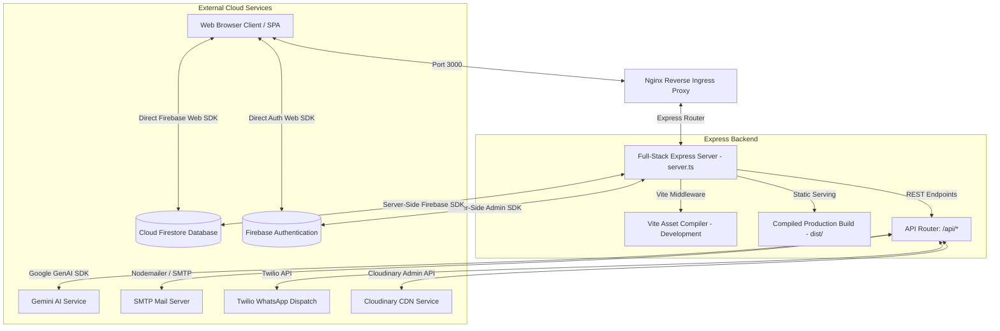
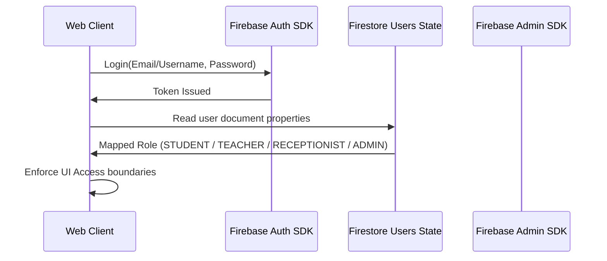

# PROJECT.md — Sunshine ERP Single Source of Truth

Welcome to the **Sunshine Classes ERP (Sunshine ERP)** project documentation. This document is the absolute single source of truth for all developers, administrators, and AI assistants. It details the complete architecture, tech stack, codebase structure, security controls, business logic, user roles, API specifications, and guidelines to ensure frictionless ongoing development and maintenance.

---

## 1. Project Overview

### Purpose
Sunshine ERP is a unified, full-stack administrative platform and educational portal built to manage student lifecycles, fee collection cycles, multi-role dashboards, student performance, staff operations, and digital assets for **Sunshine Classes**.

### Vision
To provide a paperless, automated administrative ecosystem that coordinates students, parents, teachers, receptionists, and founders. It bridges administrative workflows (such as online admission, fee collections, real-time receipts, and attendance) with pedagogical tools (homework, test marks, notifications, and study resources).

### Target Users
- **Founders & Co-Founders**: Full system telemetry, system settings, global financial statements, audit logs, and teacher management.
- **Administrators**: Complete CRUD access for students, batches, staff accounts, fee modifications, and system configuration.
- **Receptionists**: Handlers of front-desk operations, manual/online admissions, inquiry tracking, face-to-face fee collections, and subscription configurations.
- **Teachers**: Class management, batch communications, student attendance, homework distribution, test grading, and timetable tracking.
- **Students (and Parents)**: Homework portals, grades tracking, fee transaction history, class calendars, online resources, and direct messaging.
- **Public/Leads**: Website homepage visitor, NCERT study material search, course reviews, and digital enrollment.

### Business Goals
1. **Reduce Overhead**: Automate manual billing, receipt creation, and batch reminders.
2. **Improve Data Accuracy**: Enforce rigorous typing schemas and centralize data state securely in Firestore with reliable local-cache fallbacks.
3. **Enhance Security**: Implement tight role-based access control (RBAC), enforce hashed password schemes (`simpleSecureHash`), and eliminate front-end authentication bypasses.
4. **Interactive Admissions**: Streamline the onboarding experience with real-time face captures using integrated device webcams during student enrollments.

---

## 2. Tech Stack

| Layer | Technology / Tool | Version | Purpose |
| :--- | :--- | :--- | :--- |
| **Frontend** | React | 18+ | Component-driven UI composition |
| | Vite | 5+ | Fast compilation and module bundling |
| | Tailwind CSS | 4+ | Utility-first modular styling |
| | React Router DOM | 6+ | Declarative client-side routing |
| | Motion | 11+ | Smooth transitions and state animations |
| | Lucide React | Latest | Modern iconography set |
| | Recharts & D3 | Latest | Complex analytics, charts, and visualizations |
| **Backend** | Node.js / Express | 20+ | Multi-route REST API & production asset server |
| | tsx & esbuild | Latest | Hot-reloading server runtimes and bundled CJS server compilations |
| **Database** | Firebase Firestore | v10+ | Durable, real-time cloud data state persistence |
| **Authentication** | Firebase Auth | v10+ | Real-time secure identity provider (Client + Admin SDK) |
| **Media Storage** | Cloudinary | Latest | Cloud-hosted student photos and document storage |
| **Comms / APIs** | Twilio WhatsApp API | Latest | Automated and manual WhatsApp alert dispatches |
| | Nodemailer | Latest | Transactional emails with fallback SMTP pipelines |
| | Google GenAI SDK | Latest | Server-side intelligent chatbots (`/api/chat`) |

---

## 3. Project Architecture

The architecture represents a robust **full-stack Express-Vite structure** running inside isolated containers.



### Flow Mechanics
- **In Development**: The Express backend loads Vite as a middleware (`createViteServer({ middlewareMode: true })`), enabling hot module compilation on Port 3000.
- **In Production**: Vite compiles the SPA to `/dist` at build-time. The server loads `dist/index.html` as the catch-all response and serves other assets statically. The backend is compiled into a single unified `dist/server.cjs` file with `esbuild`.
- **Dual Database Strategy**: All state mutations are synchronously committed to **Cloud Firestore** for persistent storage, with a local-first mirror saved to `localStorage` to bypass network latency during initial renders.

---

## 4. Folder Structure

```text
/
├── .env.example                # Example environment variables (No raw secrets!)
├── firestore.rules             # Secure, role-enforced Firestore security configuration
├── package.json                # Project configurations, dependencies, and build commands
├── server.ts                   # Entry point for Express + Vite integration and APIs
├── metadata.json               # Platform configuration containing permissions & capabilities
├── AGENTS.md                   # Strict instructions and constraints for coding assistants
├── PROJECT.md                  # Permanent project documentation (This file)
├── api/                        # Standalone API modules
│   └── chat.ts                 # Chatbot endpoint integration with Gemini API
├── src/                        # React Frontend Source
│   ├── main.tsx                # Frontend entry point
│   ├── App.tsx                 # Core App router, central state orchestrator, global handlers
│   ├── index.css               # Tailwind CSS theme configurations and global imports
│   ├── types.ts                # Strict TypeScript interfaces and enums (Single Source of Truth)
│   ├── data.ts                 # Local seeding mock datasets
│   ├── auth/                   # Authentication logic
│   │   └── useAuth.tsx         # React Auth context wrapper for Firebase Session tracking
│   ├── components/             # Reusable UI dashboard elements
│   │   ├── LandingPage.tsx     # Student-facing public website & online admissions
│   │   ├── StudentDashboard.tsx# Custom workspace for active students
│   │   ├── TeacherDashboard.tsx# Classroom and grading dashboard for teachers
│   │   ├── ReceptionDashboard.tsx# Cashiers desk, enrollment queues, subscription config
│   │   ├── AdminDashboard.tsx  # Executive-level operations portal
│   │   ├── CloudinaryUpload.tsx# Media uploader with Direct Camera Capture module
│   │   ├── ChatBot.tsx         # Inline AI helper widget
│   │   └── SunshineLogo.tsx    # Styled brand logo
│   ├── lib/                    # Core utilities and client helpers
│   │   ├── firebase.ts         # Firebase App, Firestore, Auth client initializations
│   │   ├── feeUtils.ts         # Automated monthly billing cycle & migration engines
│   │   ├── pdfGenerator.ts     # Client-side dynamic fee receipts PDF compilers
│   │   └── whatsappService.ts  # WhatsApp message assembly routines
│   └── services/               # Integrations
│       └── cloudinaryService.ts# Signature validations and asset operations
```

---

## 5. Environment Variables

All parameters must be declared in `.env.example` with empty fields. Never commit raw passwords or certificates.

```env
# Server Ingress Configuration
PORT=3000

# Firebase Server Configuration (Base64 Service Account or Default Credentials)
FIREBASE_CONFIG_JSON=

# Gemini AI Credentials
GEMINI_API_KEY=

# Cloudinary CDN Integration
CLOUDINARY_CLOUD_NAME=
CLOUDINARY_API_KEY=
CLOUDINARY_API_SECRET=
CLOUDINARY_UPLOAD_PRESET=

# Outbound WhatsApp Integration (Twilio Sandbox or Production)
TWILIO_ACCOUNT_SID=
TWILIO_AUTH_TOKEN=
TWILIO_FROM_WHATSAPP=

# Outbound Email (SMTP Configuration)
SMTP_HOST=
SMTP_PORT=
SMTP_USER=
SMTP_PASS=
SMTP_FROM=
```

---

## 6. Database Structure

Sunshine ERP relies on the `/src/types.ts` specification synced to Firestore in the `sunshine_erp_state` document namespace.

### Firestore Namespace Document Root: `sunshine_erp_state`

Data is categorized in Firestore document states under keys corresponding to collection roles.

| Document Key | Entity Type | Purpose | Key Fields |
| :--- | :--- | :--- | :--- |
| `students` | `Student[]` | Active student records | `id`, `rollNo`, `name`, `class`, `preferredBatch`, `status`, `monthlyFee` |
| `teachers` | `Teacher[]` | Staff teachers | `id`, `name`, `specialty` (string[]), `qualification` |
| `users` | `User[]` | System login credentials | `id`, `username`, `email`, `role`, `password` (Hashed) |
| `admissions` | `Admission[]`| Registration records | `id`, `studentName`, `className`, `status` ('PENDING'\|'APPROVED') |
| `fee_statuses` | `FeeStatus[]`| Dynamic monthly fees tracker| `id`, `studentId`, `month` (e.g. 'June 2026'), `pendingFee`, `status` |
| `fee_receipts` | `FeeReceipt[]`| Validated payment bills | `id`, `studentId`, `amountPaid`, `paymentMode`, `date` |
| `audit_logs` | `AuditLog[]` | Telemetry logs | `id`, `userId`, `action`, `details`, `timestamp` |
| `subscription_config`| `SubscriptionConfig`| Config limits | `gracePeriod`, `billingDate`, `lateFee`, `cloudinaryCloudName` |

### Key Object Schemas (Strict Types)

#### Student Object Structure
*Note: Students must not contain `batchId`. Instead, utilize preferredBatch (string).*
```typescript
interface Student {
  id: string;
  userId: string;
  rollNo: string;
  name: string;
  class: string;
  fatherName: string;
  motherName: string;
  dob: string;
  gender: string;
  address: string;
  mobile: string;
  whatsapp: string;
  parentMobile: string;
  email: string;
  preferredBatch: string; // Dynamic string naming the batch (E.g. "Class 10 - Evening Stars")
  preferredTiming: string;
  admissionDate: string;
  attendancePercentage: number;
  status: 'ACTIVE' | 'SUSPENDED' | 'COMPLETED' | 'DEPARTED';
  photoUrl?: string;
  documentUrl?: string;
  feeStartMonth: string;  // Format "July 2026"
  monthlyFee: number;
  dueDay: number;
  admissionFee: number;
  registrationFee: number;
  discount: number;
  scholarship: number;
  currentBalance: number;
}
```

#### Teacher Object Structure
*Note: Teachers must not contain a singular `subject` string. Instead, utilize `specialty` as a string array.*
```typescript
interface Teacher {
  id: string;
  userId: string;
  name: string;
  email: string;
  phone: string;
  specialty: string[]; // List of subjects. E.g. ["Science", "Mathematics"]
  qualification: string;
  salary: number;
  joiningDate: string;
  status: 'ACTIVE' | 'INACTIVE';
}
```

#### FeeStatus Structure
```typescript
interface FeeStatus {
  id: string;
  studentId: string;
  studentName: string;
  class: string;
  month: string;           // E.g. "June 2026", "July 2026"
  totalFee: number;
  discount: number;
  scholarship: number;
  paidFee: number;
  pendingFee: number;
  status: 'PAID' | 'PENDING' | 'PARTIAL';
  dueDate: string;         // Format: 'YYYY-MM-DD'
  billingMonth: string;    // E.g. "June"
  billingYear: string;     // E.g. "2026"
  paymentHistory: {
    amount: number;
    date: string;
    mode: string;
    receiptId: string;
  }[];
  receiptIds: string[];
}
```

---

## 7. Authentication & Roles

Sunshine Classes ERP integrates **Firebase Authentication** mapped with custom metadata attributes from the Firestore `users` state.



### Simplified Credentials Policy (For Easy Testing & Deployments)
- **Automatic Username Generation**: During student enrollments, teacher onboarding, or approval workflows, usernames are automatically generated from the first name (lowercased) followed by a simple unique auto-incrementing counter if duplicates exist. E.g. `priyansu`, `priyansu1`.
- **Default Password**: Set uniformly to `"Sunshine123"` upon creation.
- **Immediate Alert Popup**: When any enrollment is approved, or students/teachers are registered, a modal alert immediately pops up on screen displaying the simplified username and password so administrators or cashiers can instantly share them with the user.
- **Hashed Password Storage**: Plaintext passwords are cryptographically salted and written as `sha256_<hash>` by the frontend and server using `simpleSecureHash` to prevent data leaks.

---

## 8. Main Features

### 1. Unified Student Lifecycle Management
- **Admissions Processing**: Real-time status tracker for online admissions. One-click approvals automatically register students, provision logins, and write 12 months of pending fee records.
- **Device Camera Integration**: The Cloudinary upload modal includes a fully functional webcam capture button allowing administrators and students to use their camera viewfinder, focus the student inside a visual ring, and upload the portrait directly.

### 2. Fee Management Engine
- **Flexible Invoices**: Automatically generates monthly bills based on class structures (Class 10: ₹1200, Class 9: ₹1000, others: ₹700).
- **Payment Collection Modes**: Receptionists collect payments via UPI, Cash, Check, or Cards. Partial payments are logged into the history.
- **Client PDF Compiler**: Generates high-fidelity printable receipts instantly on-screen with digital transaction receipts.

### 3. Smart Communications Pipeline
- **Email Dispatch Endpoint**: Uses `/api/send-email` with templates to send invoices, attendance records, or homework.
- **Twilio WhatsApp Endpoint**: `/api/send-whatsapp` pushes real-time text logs and homework updates directly to registered parent numbers.

---

## 9. API Specifications

### Online Enrollment Intake
- **Endpoint**: `POST /api/enroll` (also alias `POST /api/admissions`)
- **Authentication**: None (Public Access)
- **Request Payload**:
  ```json
  {
    "studentName": "Aarav Sharma",
    "fatherName": "Rajesh Sharma",
    "motherName": "Sita Sharma",
    "dob": "2011-05-15",
    "gender": "Male",
    "className": "Class 10",
    "mobile": "9876543210",
    "email": "aarav@example.com",
    "address": "123 Academic Block, Pihani",
    "preferredBatch": "Class 10 - Evening Stars"
  }
  ```
- **Response (201 Created)**:
  ```json
  {
    "status": "success",
    "admissionId": "ADM-2026-03",
    "student": { "id": "s-new-xyz", "rollNo": "SC-1004", ... },
    "user": { "username": "aarav", "role": "STUDENT" },
    "feeRecords": [...]
  }
  ```

### AI Chatbot Orchestration
- **Endpoint**: `POST /api/chat`
- **Request**: `{ "message": "What are Class 10 timings?", "history": [] }`
- **Response**: `{ "reply": "Class 10 timings are from 04:00 PM to 06:30 PM." }`

---

## 10. Security Controls & Firestore Rules

Our `firestore.rules` enforces locked production environments to secure customer records.

```javascript
rules_version = '2';
service cloud.firestore {
  match /databases/{database}/documents {
    match /sunshine_erp_state/{document} {
      allow read: if true; // Public read permitted for directory rendering
      allow write: if request.auth != null; // Writes restricted to certified accounts
    }
    match /users/{userId} {
      allow read, write: if request.auth != null;
    }
  }
}
```

---

## 11. Coding & AI Development Standards

To preserve codebase structural integrity, future developers and AI assistants must follow these strict rules:

### Schema Boundaries (Absolutely Non-Negotiable)
1. **Students**: Always use `student.preferredBatch` (type string) for the student's batch name. **DO NOT** use `student.batchId`.
2. **Teachers**: Always use `teacher.specialty` (type string[]) for the teacher's specialization list. **DO NOT** use `teacher.subject` as a direct string.
3. **Fee Status**: Always use `month` (e.g., 'June 2026'), `totalFee`, `paidFee`, `pendingFee`, `status` ('PAID' | 'PENDING' | 'PARTIAL'), and `dueDate` (string formatted 'YYYY-MM-DD').

### Visual Quality & Design Philosophy
- **Desktop-First Precision**: Ensure components use fluid responsive styling layouts (`w-full max-w-7xl mx-auto`).
- **Clean Elements**: No simulated CLI terminals, pseudo-technical "online" telemetry tags, or low-quality slop. Keep margins and typography spacious, readable, and elegant.
- **Deterministic IDs**: Every new button, input, modal layout, or click-trigger **MUST** be created with an explicit, unique, and lowercase `id` attribute.

---

## 12. Local Development

### Installation
```bash
npm install
```

### Run Locally (Dev Mode)
```bash
npm run dev
```

### Production Bundling
```bash
npm run build
```

---

## 13. Future Roadmap

### High Priority
- Fully automated integration with real-time WhatsApp webhooks for automated parent query resolving.
- Dedicated native mobile app companion container wrappers.

### Medium Priority
- Automated multi-currency gateway portals for online parent credit-card collections.
- Predictive AI analytics for grading and performance vectors.

---

### End of Documentation
*Maintain this document with maximum precision on every database schema addition or API change.*
